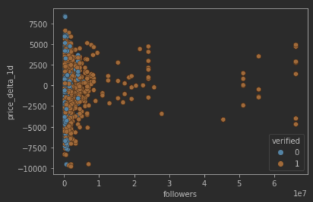
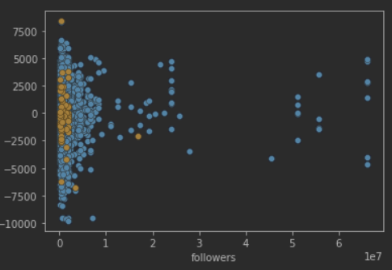
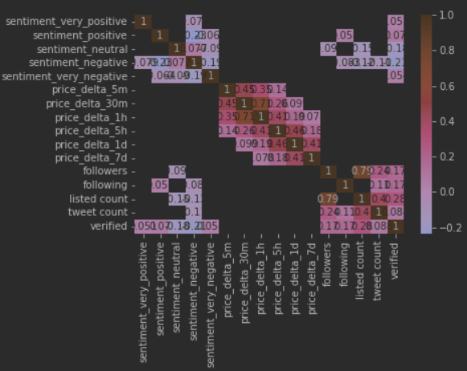
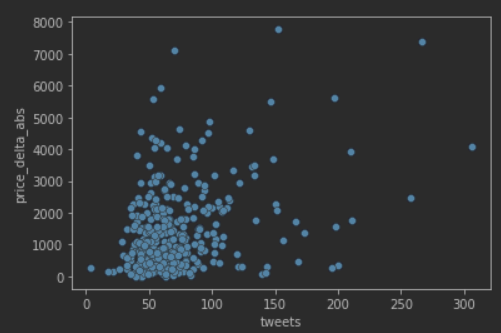

# Efecto de Twitter en el Bitcoin

## Objetivos:

- El principal objetivo de este proyecto es comprobar si existe una relación entre las publicaciones hechas en Twitter por distintas cuentas (con diferentes dimensiones de repercusión mediatica) sobre el precio de la criptomoneda Bitcoin. Esto considerando distintos tipos de variables como lo son los seguidores, cuentas seguidas y verificación de la cuenta.
- Estimar si es que es posible, luego de que tipo de publicación es ideal el invertir en la criptomoneda Bitcoin para obtener un redito económico.

## Hallazgos:

Para empezar hay que destcar que los principales filtros aplicados a los datos son: tweets con la palabra bitcoin y que solo trabajamos con cuentas con mas de 150.000 seguidores.

### Alnalisis de sentimientos:

Para el proyecto usamos un algoritmo de analisis de sentimiento sobre los tweets, esto consiste en que el algoritmo determina si es que lo que dice en el tweet es de connotación positiva, neutral o negativa con el fin de poder estudiar como pueden afectar tweets con distinta connotación al precio del Bitcoin. Destacar que siempre existe un margen de error en el que se puede evaluar un comentario positivo como negativo y viceversa.

- Del algoritmo de analisis de sentimiento llegamos a que según este, hay mas tweets de connotación negativa y neutral por sobre los de connotación positiva, dictando una tendencia que influirá en el desrrollo del proyecto.

### Analisis y relaciones entre variables

Se realizó una comparación de todas las variables a estudiar y el valor registrado del Bitcoin cada 5 minutos, 30 minutos, 1 hora, 5 horas, 1 día y 7 días. De algunos de estos graficos y el analisis de ellos rescatamos que:

1. Seguidores vs Delta del valor (1 día), diferenciando verificados de no veridicados

   

   Con esto podemos ver que según mas seguidores tienen, existen tweets que **podrian** haber generado (en principio) cambios relativamente significativos en el precio del Bitcoin.

2. Seguidores vs Delta del valor (1 día), diferenciando tweets de connotación positiva

   

   En base a este grafico se puede decir que:
   - Las cuentas con más seguidores tienden a no decantarse por manifestarse positivamente con respecto al Bitcoin.
   - Hay cuentas con no tantos seguidores que se manifiestan de forma claramente positiva pudiendo tener posiblemente un impacto positivo en el valor del Bitcoin.

3. Cantidad de tweets vs Delta del valor

   
   
   
   
   Con esto podemos decir que existe bastante relación entre estas variables lo que nos induce a pensar que si puede tener un rol fundamental en la estimación del valor del Bitcoin

### Regresión Lineal

**Bold** and _Italic_ and `Code` text

[Link](url) and 
